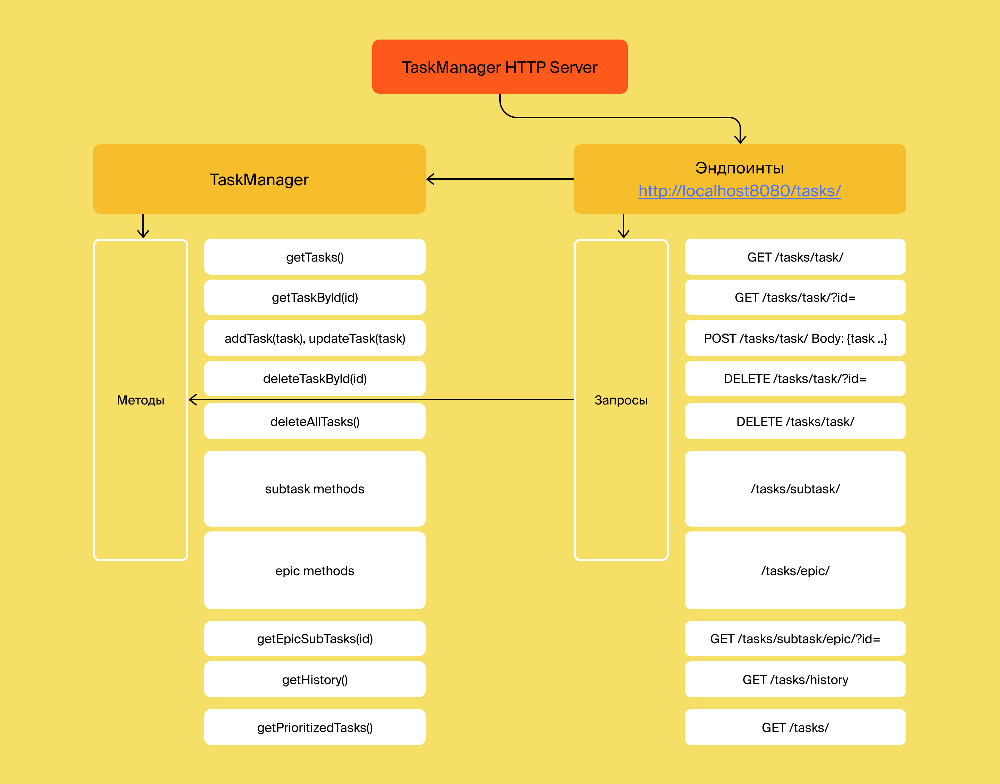

# Task-manager
Менеджер задач для управления сроками и задачами команды разработки

#### Структура проекта:

Возможности API:
- обновлять, создавать, удалять задачи;
- запрашивать задачи по id и списком;
- сохранение истории вызова задач;
- получение списка приоритетных задач, основанных на дате постановки задачи.
Задачи бывают трёх видов:
1. Task - стандартная задача;
2. Epic - задача, включающая в себя несколько подзадач;
3. Subtask - задача, входящая в состав одной из Epic - задач.

Задачи хранятся на сервере KVServer
Соединение с KVServer происходит с помощью HTTP-клиента KVTaskClient: 
загружает данные с сервера и передаёт их в него.

В проекте написаны 104 Unit -теста, покрывающие в общей сложности 96 % методов